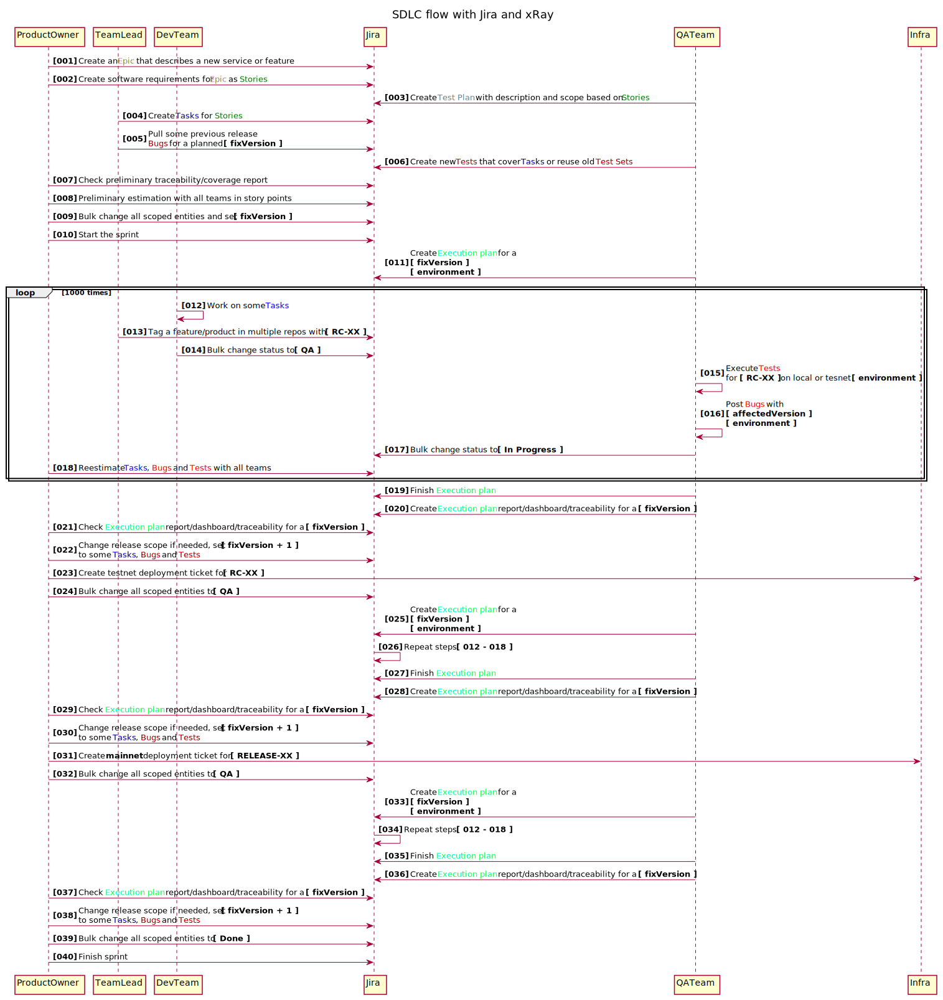

# Testing flow and diagrams

### QA manual process (WIP, it's an example flow that describes only manual part)

### QA automation process
- Build all services in other repos and tag them like `blockscout/blockscout:vX.X.X-rc1`
- Call `workflow_call` of that repo with new versions
- E2E suite matrix for `network` + `services` deployed in `EKS`
- Chaos suite
- Warm-up and check baseline suite for inbound UI/API load (`EKS`)
- Analyze `grafana` dashboards/comparison dashboards
- Tag images like `blockscout/blockscout:vX.X.X-rc2`
- Run soak tests on mainnet/testnets to check outbound load (`indexers`), check `grafana` dashboards/comparison dashboards
- Go to manual flow, testnets installations, etc.
- Tag images `blockscout/blockscout:vX.X.X` and release